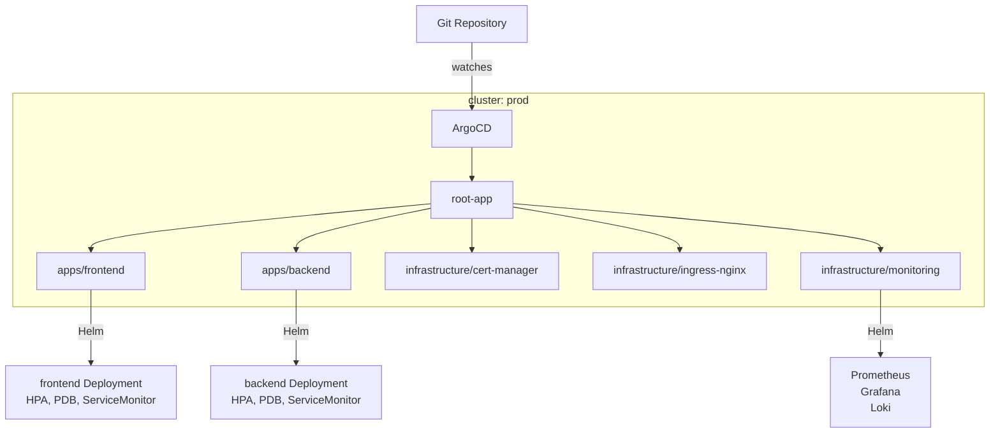
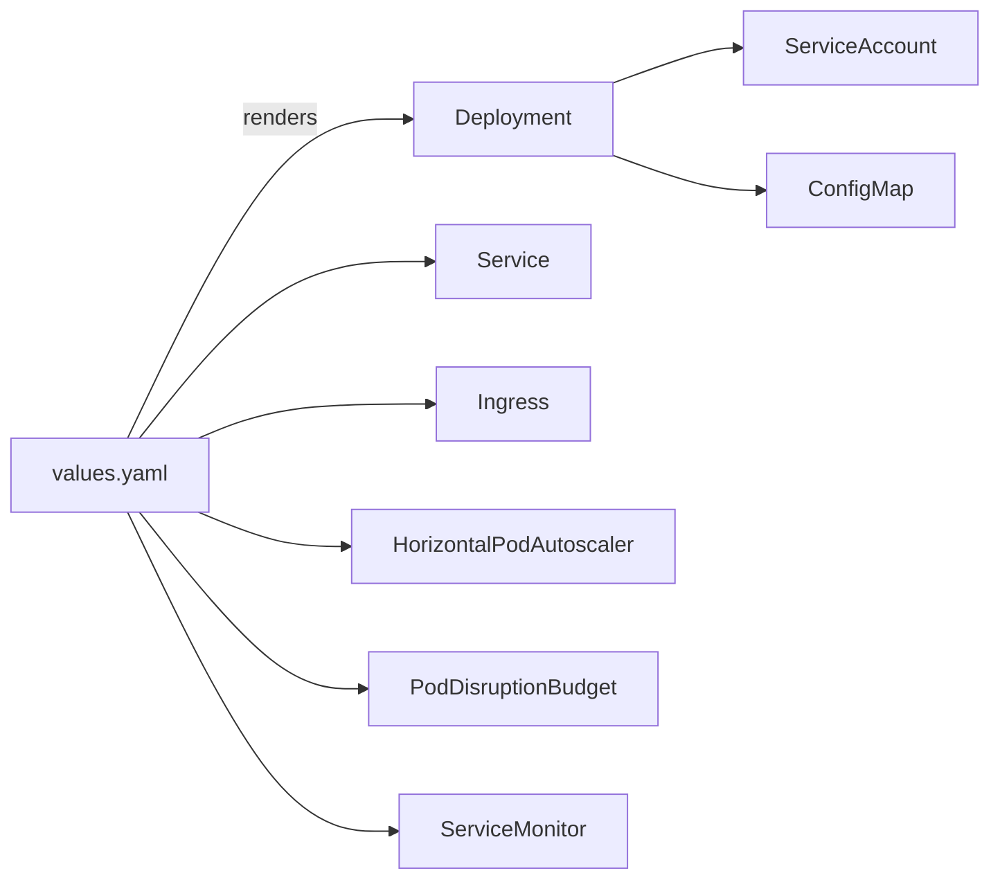
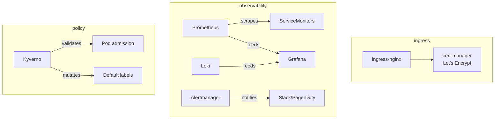

# Architecture

## Overview

This platform uses the **App-of-Apps** GitOps pattern with ArgoCD. A single root application in each cluster bootstraps all other applications from this repository. No `kubectl apply` is ever run manually in production — every change is a git commit.

```
Git push → ArgoCD detects drift → applies Helm/Kustomize → cluster converges
```

## Repository Layout

```
k8s-platform/
├── clusters/          # One directory per cluster (root ArgoCD apps)
│   ├── dev/
│   ├── staging/
│   └── prod/
├── apps/              # ArgoCD Application manifests
│   ├── base/          # Shared app definitions (Kustomize base)
│   └── overlays/      # Per-environment patches (values overrides)
│       ├── dev/
│       ├── staging/
│       └── prod/
├── charts/            # Internal Helm charts
│   └── webapp/        # Reusable chart for HTTP services
├── infrastructure/    # Platform-level ArgoCD apps
│   ├── cert-manager/
│   ├── ingress-nginx/
│   └── monitoring/    # Prometheus + Grafana + Loki
├── policies/          # Kyverno ClusterPolicy resources
│   └── kyverno/
└── scripts/           # Operational scripts
    └── bootstrap.sh
```

## App-of-Apps Pattern



## Sync Strategy by Environment

| Environment | Sync | Pruning | Self-Heal | Notes |
|-------------|------|---------|-----------|-------|
| dev | Automated | ✓ | ✓ | Fast feedback; auto-prunes orphaned resources |
| staging | Automated | ✓ | ✓ | Mirrors prod behavior for pre-release testing |
| prod | **Manual** | ✗ | ✗ | Requires human approval via ArgoCD UI |

## Helm Chart — webapp

The `charts/webapp` chart is a generic Helm chart used by all HTTP workloads. It is parameterized entirely through values overlays.

### Resource Hierarchy



### Production Values (prod overlay)

| Parameter | Value | Rationale |
|-----------|-------|-----------|
| `replicaCount` | 3 | Minimum for HA across 3 AZs |
| `hpa.minReplicas` | 3 | Never scale below HA threshold |
| `hpa.maxReplicas` | 20 | Caps runaway scaling cost |
| `pdb.minAvailable` | 2 | Rolling update safety net |
| `resources.limits.cpu` | 500m | Prevent noisy neighbours |
| `resources.limits.memory` | 512Mi | OOM kill before node pressure |
| `securityContext.runAsUser` | 1000 | Non-root enforcement |
| `securityContext.readOnlyRootFilesystem` | true | Container hardening |

## Infrastructure Components



## Security Model

### Pod Security

Every workload deployed via `charts/webapp` gets:

```yaml
securityContext:
  runAsNonRoot: true
  runAsUser: 1000
  fsGroup: 1000

containers:
  - securityContext:
      allowPrivilegeEscalation: false
      readOnlyRootFilesystem: true
      capabilities:
        drop: [ALL]
```

### Kyverno Policies

| Policy | Mode | What it enforces |
|--------|------|-----------------|
| `disallow-privilege-escalation` | Enforce | `allowPrivilegeEscalation=false` |
| `require-resource-limits` | Enforce | CPU + memory limits required |
| `disallow-latest-tag` | Enforce | Pinned image tags; digests in prod |
| `require-run-as-non-root` | Enforce | `runAsNonRoot=true` or UID ≥ 1000 |
| `require-app-labels` | Audit | Standard k8s.io/app labels |

### Network Segmentation

Traffic flow is controlled at three layers:

1. **Ingress** — `ingress-nginx` terminates TLS; only ports 80/443 exposed
2. **Service mesh** (optional) — mTLS between services if Istio is deployed
3. **NetworkPolicy** — default-deny in each namespace; allowlist per service

## Deployment Flow

```mermaid
sequenceDiagram
    participant Dev as Developer
    participant Git as GitHub
    participant CI as GitHub Actions
    participant Argo as ArgoCD
    participant K8s as Kubernetes

    Dev->>Git: git push
    Git->>CI: trigger validate workflow
    CI->>CI: helm lint
    CI->>CI: kustomize build
    CI->>CI: kubeconform validate
    CI->>CI: checkov security scan
    CI-->>Git: ✓ checks pass

    Git->>Argo: webhook / polling (3m)
    Argo->>Argo: detect git drift
    Argo->>K8s: apply manifests
    K8s-->>Argo: resource status
    Argo-->>Git: sync status
```



## Bootstrap

To provision a new cluster from scratch:

```bash
# Prerequisites: kubectl context pointing to target cluster
./scripts/bootstrap.sh

# This installs ArgoCD and applies the root-app for the target cluster.
# ArgoCD then reconciles everything else from git.
```

See [scripts/bootstrap.sh](../scripts/bootstrap.sh) for details.
